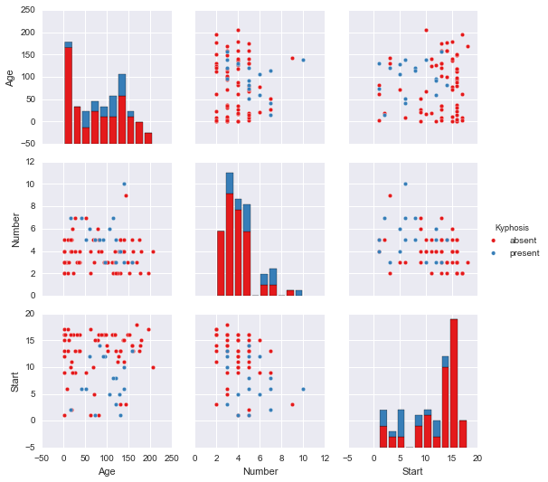
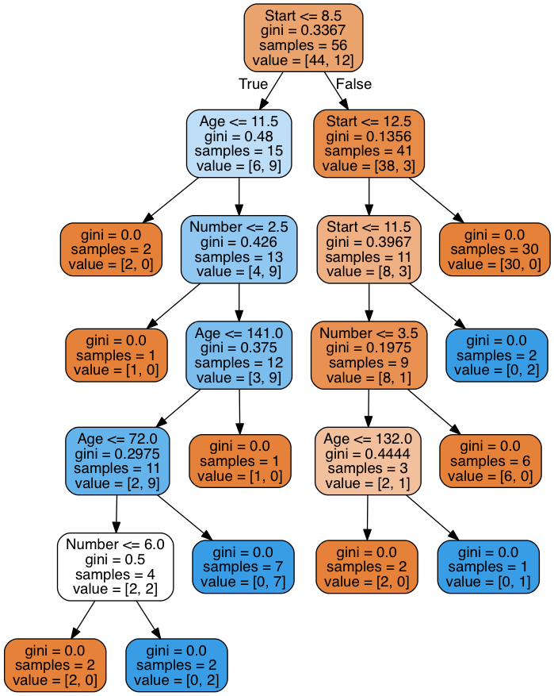

# Decision Trees and Random Forests in Python (From Jose Portilla)

This is the code for the lecture video which goes over tree methods in Python. Reference the video lecture for the full explanation of the code!

I also wrote a [blog post](https://medium.com/@josemarcialportilla/enchanted-random-forest-b08d418cb411#.hh7n1co54) explaining the general logic of decision trees and random forests which you can check out. 

## Import Libraries


```python
import pandas as pd
import numpy as np
import matplotlib.pyplot as plt
import seaborn as sns
%matplotlib inline
```

## Get the Data


```python
df = pd.read_csv('kyphosis.csv')
```


```python
df.head()
```


<div>
<table border="1" class="dataframe">
  <thead>
    <tr style="text-align: right;">
      <th></th>
      <th>Kyphosis</th>
      <th>Age</th>
      <th>Number</th>
      <th>Start</th>
    </tr>
  </thead>
  <tbody>
    <tr>
      <th>0</th>
      <td>absent</td>
      <td>71</td>
      <td>3</td>
      <td>5</td>
    </tr>
    <tr>
      <th>1</th>
      <td>absent</td>
      <td>158</td>
      <td>3</td>
      <td>14</td>
    </tr>
    <tr>
      <th>2</th>
      <td>present</td>
      <td>128</td>
      <td>4</td>
      <td>5</td>
    </tr>
    <tr>
      <th>3</th>
      <td>absent</td>
      <td>2</td>
      <td>5</td>
      <td>1</td>
    </tr>
    <tr>
      <th>4</th>
      <td>absent</td>
      <td>1</td>
      <td>4</td>
      <td>15</td>
    </tr>
  </tbody>
</table>
</div>


## EDA

We'll just check out a simple pairplot for this small dataset.


```python
sns.pairplot(df,hue='Kyphosis',palette='Set1')
```


    <seaborn.axisgrid.PairGrid at 0x11b285f28>





## Train Test Split

Let's split up the data into a training set and a test set!


```python
from sklearn.model_selection import train_test_split
```


```python
X = df.drop('Kyphosis',axis=1)
y = df['Kyphosis']
```


```python
X_train, X_test, y_train, y_test = train_test_split(X, y, test_size=0.30)
```

## Decision Trees

We'll start just by training a single decision tree.


```python
from sklearn.tree import DecisionTreeClassifier
```


```python
dtree = DecisionTreeClassifier()
```


```python
dtree.fit(X_train,y_train)
```


    DecisionTreeClassifier(class_weight=None, criterion='gini', max_depth=None,
                max_features=None, max_leaf_nodes=None, min_samples_leaf=1,
                min_samples_split=2, min_weight_fraction_leaf=0.0,
                presort=False, random_state=None, splitter='best')


## Prediction and Evaluation 

Let's evaluate our decision tree.


```python
predictions = dtree.predict(X_test)
```


```python
from sklearn.metrics import classification_report,confusion_matrix
```


```python
print(classification_report(y_test,predictions))
```

                 precision    recall  f1-score   support
    
         absent       0.85      0.85      0.85        20
        present       0.40      0.40      0.40         5
    
    avg / total       0.76      0.76      0.76        25
    
    


```python
print(confusion_matrix(y_test,predictions))
```

    [[17  3]
     [ 3  2]]
    

## Tree Visualization

Scikit learn actually has some built-in visualization capabilities for decision trees, you won't use this often and it requires you to install the pydot library, but here is an example of what it looks like and the code to execute this:


```python
from IPython.display import Image  
from sklearn.externals.six import StringIO  
from sklearn.tree import export_graphviz
import pydot 

features = list(df.columns[1:])
features
```


    ['Age', 'Number', 'Start']


```python
dot_data = StringIO()  
export_graphviz(dtree, out_file=dot_data,feature_names=features,filled=True,rounded=True)

graph = pydot.graph_from_dot_data(dot_data.getvalue())  
Image(graph[0].create_png())  
```





## Random Forests

Now let's compare the decision tree model to a random forest.


```python
from sklearn.ensemble import RandomForestClassifier
rfc = RandomForestClassifier(n_estimators=100)
rfc.fit(X_train, y_train)
```


    RandomForestClassifier(bootstrap=True, class_weight=None, criterion='gini',
                max_depth=None, max_features='auto', max_leaf_nodes=None,
                min_samples_leaf=1, min_samples_split=2,
                min_weight_fraction_leaf=0.0, n_estimators=100, n_jobs=1,
                oob_score=False, random_state=None, verbose=0,
                warm_start=False)


```python
rfc_pred = rfc.predict(X_test)
```


```python
print(confusion_matrix(y_test,rfc_pred))
```

    [[18  2]
     [ 3  2]]
    


```python
print(classification_report(y_test,rfc_pred))
```

                 precision    recall  f1-score   support
    
         absent       0.86      0.90      0.88        20
        present       0.50      0.40      0.44         5
    
    avg / total       0.79      0.80      0.79        25
    
    

# Great Job!
