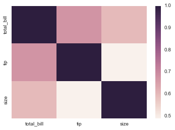
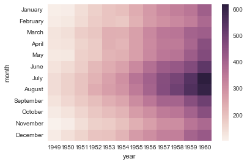
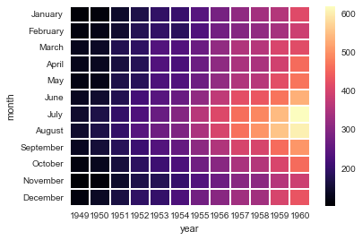
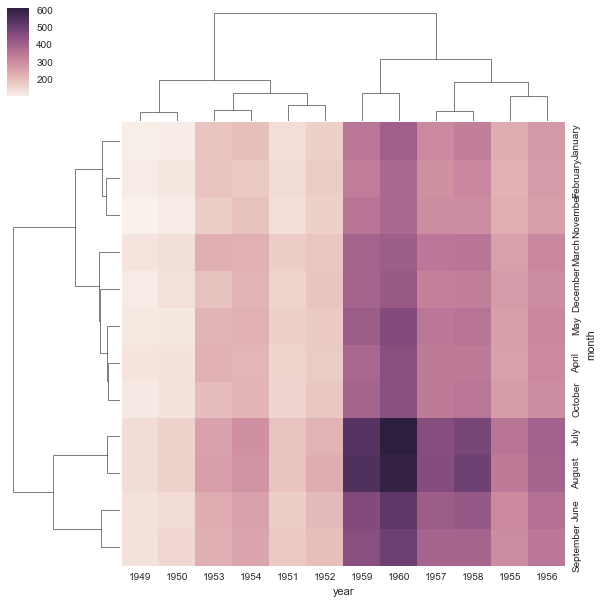
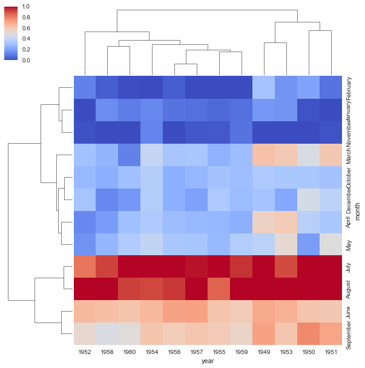

# Matrix Plots (from Jose Portilla)

Matrix plots allow you to plot data as color-encoded matrices and can also be used to indicate clusters within the data (later in the machine learning section we will learn how to formally cluster data).

Let's begin by exploring seaborn's heatmap and clutermap:


```python
import seaborn as sns
%matplotlib inline
```


```python
flights = sns.load_dataset('flights')
```


```python
tips = sns.load_dataset('tips')
```


```python
tips.head()
```


<div>
<table border="1" class="dataframe">
  <thead>
    <tr style="text-align: right;">
      <th></th>
      <th>total_bill</th>
      <th>tip</th>
      <th>sex</th>
      <th>smoker</th>
      <th>day</th>
      <th>time</th>
      <th>size</th>
    </tr>
  </thead>
  <tbody>
    <tr>
      <th>0</th>
      <td>16.99</td>
      <td>1.01</td>
      <td>Female</td>
      <td>No</td>
      <td>Sun</td>
      <td>Dinner</td>
      <td>2</td>
    </tr>
    <tr>
      <th>1</th>
      <td>10.34</td>
      <td>1.66</td>
      <td>Male</td>
      <td>No</td>
      <td>Sun</td>
      <td>Dinner</td>
      <td>3</td>
    </tr>
    <tr>
      <th>2</th>
      <td>21.01</td>
      <td>3.50</td>
      <td>Male</td>
      <td>No</td>
      <td>Sun</td>
      <td>Dinner</td>
      <td>3</td>
    </tr>
    <tr>
      <th>3</th>
      <td>23.68</td>
      <td>3.31</td>
      <td>Male</td>
      <td>No</td>
      <td>Sun</td>
      <td>Dinner</td>
      <td>2</td>
    </tr>
    <tr>
      <th>4</th>
      <td>24.59</td>
      <td>3.61</td>
      <td>Female</td>
      <td>No</td>
      <td>Sun</td>
      <td>Dinner</td>
      <td>4</td>
    </tr>
  </tbody>
</table>
</div>


```python
flights.head()
```


<div>
<table border="1" class="dataframe">
  <thead>
    <tr style="text-align: right;">
      <th></th>
      <th>year</th>
      <th>month</th>
      <th>passengers</th>
    </tr>
  </thead>
  <tbody>
    <tr>
      <th>0</th>
      <td>1949</td>
      <td>January</td>
      <td>112</td>
    </tr>
    <tr>
      <th>1</th>
      <td>1949</td>
      <td>February</td>
      <td>118</td>
    </tr>
    <tr>
      <th>2</th>
      <td>1949</td>
      <td>March</td>
      <td>132</td>
    </tr>
    <tr>
      <th>3</th>
      <td>1949</td>
      <td>April</td>
      <td>129</td>
    </tr>
    <tr>
      <th>4</th>
      <td>1949</td>
      <td>May</td>
      <td>121</td>
    </tr>
  </tbody>
</table>
</div>


## Heatmap

In order for a heatmap to work properly, your data should already be in a matrix form, the sns.heatmap function basically just colors it in for you. For example:


```python
tips.head()
```


<div>
<table border="1" class="dataframe">
  <thead>
    <tr style="text-align: right;">
      <th></th>
      <th>total_bill</th>
      <th>tip</th>
      <th>sex</th>
      <th>smoker</th>
      <th>day</th>
      <th>time</th>
      <th>size</th>
    </tr>
  </thead>
  <tbody>
    <tr>
      <th>0</th>
      <td>16.99</td>
      <td>1.01</td>
      <td>Female</td>
      <td>No</td>
      <td>Sun</td>
      <td>Dinner</td>
      <td>2</td>
    </tr>
    <tr>
      <th>1</th>
      <td>10.34</td>
      <td>1.66</td>
      <td>Male</td>
      <td>No</td>
      <td>Sun</td>
      <td>Dinner</td>
      <td>3</td>
    </tr>
    <tr>
      <th>2</th>
      <td>21.01</td>
      <td>3.50</td>
      <td>Male</td>
      <td>No</td>
      <td>Sun</td>
      <td>Dinner</td>
      <td>3</td>
    </tr>
    <tr>
      <th>3</th>
      <td>23.68</td>
      <td>3.31</td>
      <td>Male</td>
      <td>No</td>
      <td>Sun</td>
      <td>Dinner</td>
      <td>2</td>
    </tr>
    <tr>
      <th>4</th>
      <td>24.59</td>
      <td>3.61</td>
      <td>Female</td>
      <td>No</td>
      <td>Sun</td>
      <td>Dinner</td>
      <td>4</td>
    </tr>
  </tbody>
</table>
</div>


```python
# Matrix form for correlation data
tips.corr()
```


<div>
<table border="1" class="dataframe">
  <thead>
    <tr style="text-align: right;">
      <th></th>
      <th>total_bill</th>
      <th>tip</th>
      <th>size</th>
    </tr>
  </thead>
  <tbody>
    <tr>
      <th>total_bill</th>
      <td>1.000000</td>
      <td>0.675734</td>
      <td>0.598315</td>
    </tr>
    <tr>
      <th>tip</th>
      <td>0.675734</td>
      <td>1.000000</td>
      <td>0.489299</td>
    </tr>
    <tr>
      <th>size</th>
      <td>0.598315</td>
      <td>0.489299</td>
      <td>1.000000</td>
    </tr>
  </tbody>
</table>
</div>


```python
sns.heatmap(tips.corr())
```


    <matplotlib.axes._subplots.AxesSubplot at 0x11c31d470>





```python
sns.heatmap(tips.corr(),cmap='coolwarm',annot=True)
```


    <matplotlib.axes._subplots.AxesSubplot at 0x11c97a978>


Or for the flights data:


```python
flights.pivot_table(values='passengers',index='month',columns='year')
```


<div>
<table border="1" class="dataframe">
  <thead>
    <tr style="text-align: right;">
      <th>year</th>
      <th>1949</th>
      <th>1950</th>
      <th>1951</th>
      <th>1952</th>
      <th>1953</th>
      <th>1954</th>
      <th>1955</th>
      <th>1956</th>
      <th>1957</th>
      <th>1958</th>
      <th>1959</th>
      <th>1960</th>
    </tr>
    <tr>
      <th>month</th>
      <th></th>
      <th></th>
      <th></th>
      <th></th>
      <th></th>
      <th></th>
      <th></th>
      <th></th>
      <th></th>
      <th></th>
      <th></th>
      <th></th>
    </tr>
  </thead>
  <tbody>
    <tr>
      <th>January</th>
      <td>112</td>
      <td>115</td>
      <td>145</td>
      <td>171</td>
      <td>196</td>
      <td>204</td>
      <td>242</td>
      <td>284</td>
      <td>315</td>
      <td>340</td>
      <td>360</td>
      <td>417</td>
    </tr>
    <tr>
      <th>February</th>
      <td>118</td>
      <td>126</td>
      <td>150</td>
      <td>180</td>
      <td>196</td>
      <td>188</td>
      <td>233</td>
      <td>277</td>
      <td>301</td>
      <td>318</td>
      <td>342</td>
      <td>391</td>
    </tr>
    <tr>
      <th>March</th>
      <td>132</td>
      <td>141</td>
      <td>178</td>
      <td>193</td>
      <td>236</td>
      <td>235</td>
      <td>267</td>
      <td>317</td>
      <td>356</td>
      <td>362</td>
      <td>406</td>
      <td>419</td>
    </tr>
    <tr>
      <th>April</th>
      <td>129</td>
      <td>135</td>
      <td>163</td>
      <td>181</td>
      <td>235</td>
      <td>227</td>
      <td>269</td>
      <td>313</td>
      <td>348</td>
      <td>348</td>
      <td>396</td>
      <td>461</td>
    </tr>
    <tr>
      <th>May</th>
      <td>121</td>
      <td>125</td>
      <td>172</td>
      <td>183</td>
      <td>229</td>
      <td>234</td>
      <td>270</td>
      <td>318</td>
      <td>355</td>
      <td>363</td>
      <td>420</td>
      <td>472</td>
    </tr>
    <tr>
      <th>June</th>
      <td>135</td>
      <td>149</td>
      <td>178</td>
      <td>218</td>
      <td>243</td>
      <td>264</td>
      <td>315</td>
      <td>374</td>
      <td>422</td>
      <td>435</td>
      <td>472</td>
      <td>535</td>
    </tr>
    <tr>
      <th>July</th>
      <td>148</td>
      <td>170</td>
      <td>199</td>
      <td>230</td>
      <td>264</td>
      <td>302</td>
      <td>364</td>
      <td>413</td>
      <td>465</td>
      <td>491</td>
      <td>548</td>
      <td>622</td>
    </tr>
    <tr>
      <th>August</th>
      <td>148</td>
      <td>170</td>
      <td>199</td>
      <td>242</td>
      <td>272</td>
      <td>293</td>
      <td>347</td>
      <td>405</td>
      <td>467</td>
      <td>505</td>
      <td>559</td>
      <td>606</td>
    </tr>
    <tr>
      <th>September</th>
      <td>136</td>
      <td>158</td>
      <td>184</td>
      <td>209</td>
      <td>237</td>
      <td>259</td>
      <td>312</td>
      <td>355</td>
      <td>404</td>
      <td>404</td>
      <td>463</td>
      <td>508</td>
    </tr>
    <tr>
      <th>October</th>
      <td>119</td>
      <td>133</td>
      <td>162</td>
      <td>191</td>
      <td>211</td>
      <td>229</td>
      <td>274</td>
      <td>306</td>
      <td>347</td>
      <td>359</td>
      <td>407</td>
      <td>461</td>
    </tr>
    <tr>
      <th>November</th>
      <td>104</td>
      <td>114</td>
      <td>146</td>
      <td>172</td>
      <td>180</td>
      <td>203</td>
      <td>237</td>
      <td>271</td>
      <td>305</td>
      <td>310</td>
      <td>362</td>
      <td>390</td>
    </tr>
    <tr>
      <th>December</th>
      <td>118</td>
      <td>140</td>
      <td>166</td>
      <td>194</td>
      <td>201</td>
      <td>229</td>
      <td>278</td>
      <td>306</td>
      <td>336</td>
      <td>337</td>
      <td>405</td>
      <td>432</td>
    </tr>
  </tbody>
</table>
</div>


```python
pvflights = flights.pivot_table(values='passengers',index='month',columns='year')
sns.heatmap(pvflights)
```


    <matplotlib.axes._subplots.AxesSubplot at 0x11cd09320>





```python
sns.heatmap(pvflights,cmap='magma',linecolor='white',linewidths=1)
```


    <matplotlib.axes._subplots.AxesSubplot at 0x11d852780>





## clustermap

The clustermap uses hierarchal clustering to produce a clustered version of the heatmap. For example:


```python
sns.clustermap(pvflights)
```


    <seaborn.matrix.ClusterGrid at 0x11dbdf4a8>





Notice now how the years and months are no longer in order, instead they are grouped by similarity in value (passenger count). That means we can begin to infer things from this plot, such as August and July being similar (makes sense, since they are both summer travel months)


```python
# More options to get the information a little clearer like normalization
sns.clustermap(pvflights,cmap='coolwarm',standard_scale=1)
```


    <seaborn.matrix.ClusterGrid at 0x11ef9d390>





# Great Job!
